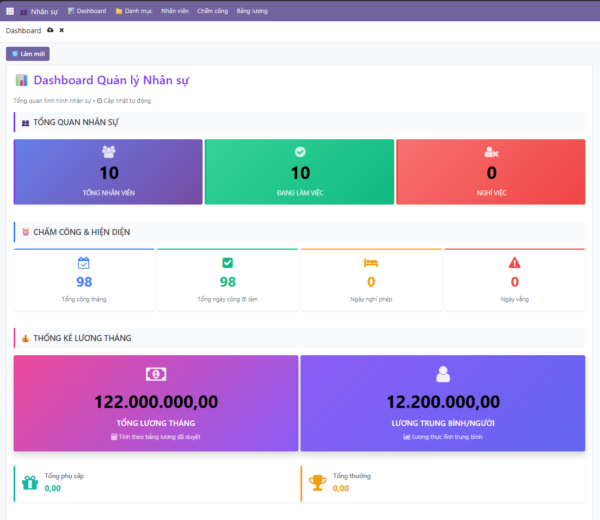
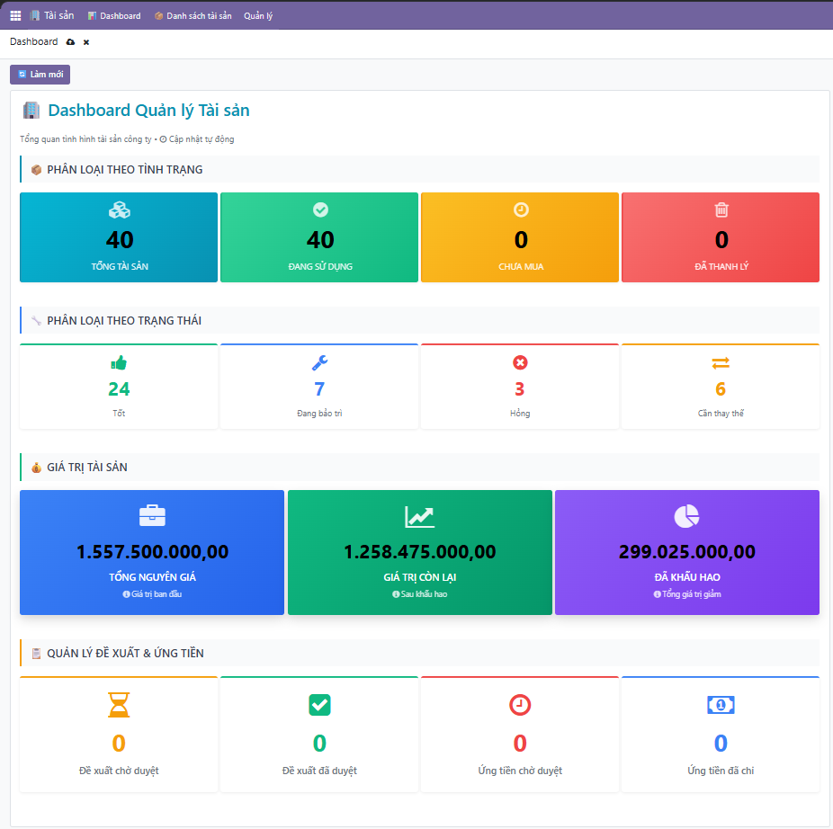
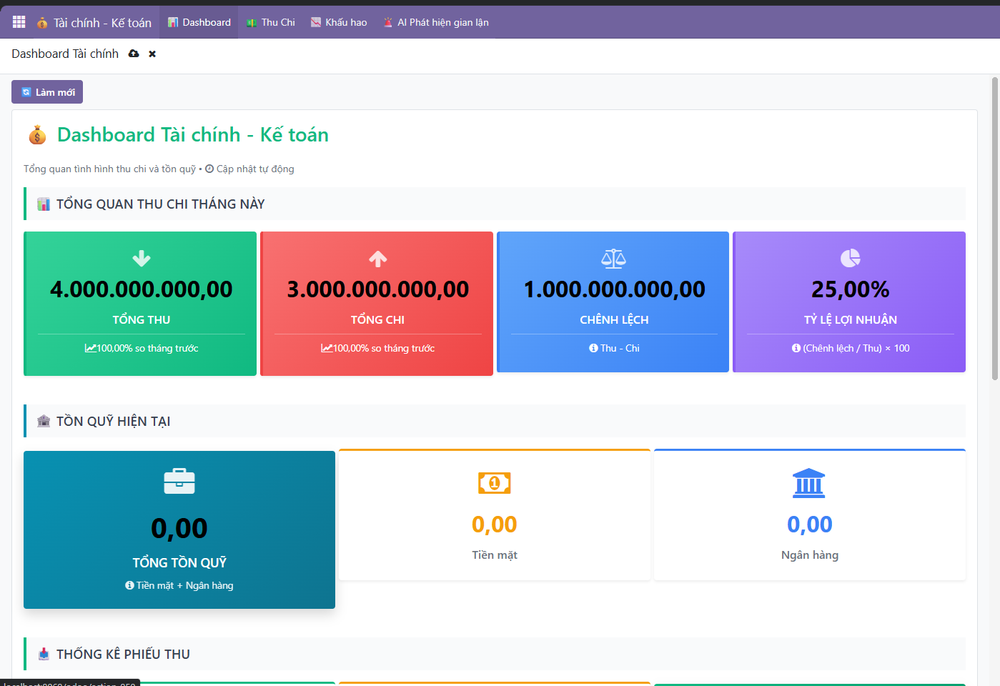
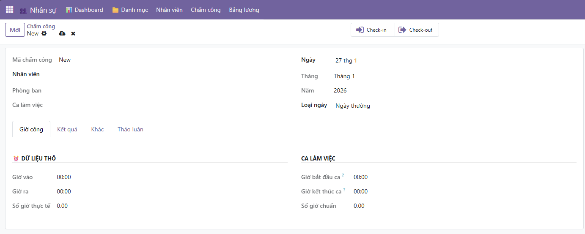
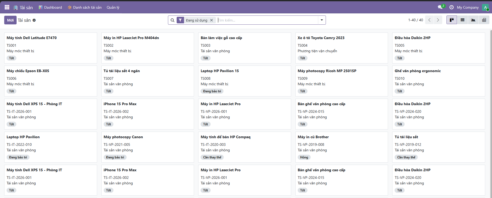
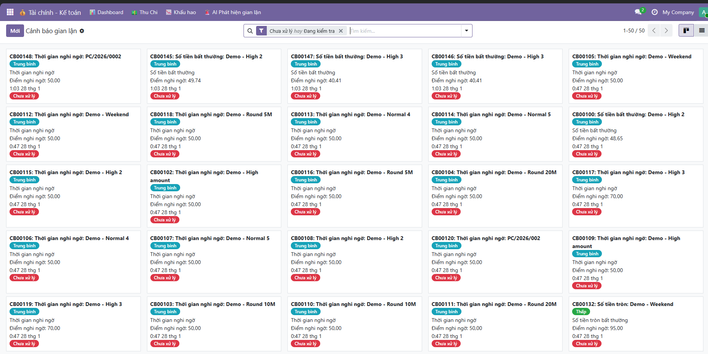

<h2 align="center">
    <a href="https://dainam.edu.vn/vi/khoa-cong-nghe-thong-tin">
    🎓 Faculty of Information Technology (DaiNam University)
    </a>
</h2>
<h2 align="center">
   XÂY DỰNG HỆ THỐNG ERP QUẢN LÝ NHÂN SỰ - TÀI SẢN – TÀI CHÍNH KẾ TOÁN
</h2>
<div align="center">
    <p align="center">
        
        
        
    </p>

[](https://www.facebook.com/DNUAIoTLab)
[](https://dainam.edu.vn/vi/khoa-cong-nghe-thong-tin)
[](https://dainam.edu.vn)

</div>

---

## 🎯 Project Poster

<p align="center">
  
</p>

<p align="center">
  <em>Poster tổng quan hệ thống ERP quản lý Nhân sự - Tài sản - Tài chính Kế toán</em>
</p>

---

## 📖 1. Giới thiệu

Hệ thống **ERP (Enterprise Resource Planning)** toàn diện được xây dựng trên nền tảng **Odoo 17**, nhằm tối ưu hóa quy trình quản lý doanh nghiệp với ba module chính:

### 🧑‍💼 Module Nhân sự
Quản lý toàn diện nguồn nhân lực doanh nghiệp:
- **Quản lý cơ cấu tổ chức**: Phòng ban, chức vụ, cấp bậc
- **Quản lý nhân viên**: Hồ sơ, hợp đồng lao động, lịch sử công tác
- **Hệ thống chấm công**: Tự động với các ca làm việc linh hoạt
- **Tính lương**: Tự động tính lương, phụ cấp, khấu trừ, thưởng phạt
- **Báo cáo**: Thống kê nhân sự, công, lương theo đa chiều

### 🏢 Module Tài sản
Quản lý tài sản cố định một cách bài bản:
- **Đề xuất mua sắm**: Quy trình đề xuất và phê duyệt tài sản
- **Quản lý tài sản**: Theo dõi vòng đời từ mua đến thanh lý
- **Cấp phát & Thu hồi**: Quản lý người sử dụng, phòng ban
- **Khấu hao tự động**: Tính khấu hao theo nhiều phương pháp
- **Dashboard**: Thống kê trực quan tài sản, giá trị, tình trạng

### 💰 Module Tài chính - Kế toán
Quản lý tài chính minh bạch kết hợp AI:
- **Quản lý thu chi**: Phiếu thu, phiếu chi, sổ quỹ điện tử
- **Tích hợp khấu hao**: Tự động tạo chứng từ khấu hao tài sản
- **AI phát hiện gian lận**: Machine Learning cảnh báo giao dịch bất thường
- **Báo cáo tài chính**: Báo cáo thu chi, dòng tiền, phân tích xu hướng
- **Thanh toán hàng loạt**: Xử lý nhiều giao dịch cùng lúc

---

## 🛠️ 2. Công nghệ & Kiến trúc hệ thống

### Stack công nghệ chính

<p align="center">
  
  
  
  
  
  
</p>

### Kiến trúc hệ thống
- **Backend**: Odoo Framework (Python) - ORM, MVC Pattern
- **Frontend**: Odoo Web Client (JavaScript/XML/QWeb)  
- **Database**: PostgreSQL với indexing tối ưu
- **Machine Learning**: Scikit-learn, Pandas, NumPy (Fraud Detection)
- **Deployment**: Docker, Docker Compose
- **Automation**: Cron Jobs, Background Jobs

### Tính năng nổi bật
✨ **Tích hợp liền mạch** giữa 3 module (Nhân sự - Tài sản - Tài chính)  
🤖 **AI phát hiện gian lận** giao dịch thời gian thực  
📊 **Dashboard trực quan** với biểu đồ và thống kê  
🔄 **Tự động hóa** quy trình nghiệp vụ (chấm công, tính lương, khấu hao)  
🔐 **Phân quyền chi tiết** theo vai trò người dùng  

---

## 📸 3. Hình ảnh giao diện hệ thống

### Dashboard Tổng quan
<p align="center">
  
  <br/>
  <em>Dashboard Nhân sự</em>
</p>

<p align="center">
  
  <br/>
  <em>Dashboard Tài sản</em>
</p>

<p align="center">
  
  <br/>
  <em>Dashboard Tài chính kế toán</em>
</p>

### Giao diện chấm công

<p align="center">
  
  <br/>
  <em>Giao diện chấm công</em>
</p>

### Danh sách tài sản

<p align="center">
  
  <br/>
  <em>Danh sách tài sản</em>
</p>

### Giao diện AI

<p align="center">
  
  <br/>
  <em>Hệ thống AI phát hiện gian lận</em>
</p>

---

## 🚀 4. Hướng dẫn cài đặt & Sử dụng

### 📋 Yêu cầu hệ thống

#### Phần mềm yêu cầu
- **Python**: 3.10 hoặc cao hơn
- **PostgreSQL**: 12+ (khuyến nghị 14 hoặc 15)
- **Docker & Docker Compose**: Latest version (nếu dùng Docker)
- **Git**: Để clone repository
- **Web Browser**: Chrome, Firefox, hoặc Edge (phiên bản mới nhất)

---

### 🐳 Cài đặt nhanh với Docker (Khuyến nghị)

Đây là cách đơn giản nhất để chạy hệ thống:

```bash
# 1. Clone repository
git clone <repository-url>
cd CNTT7

# 2. Khởi động Docker containers
docker-compose up -d

# 3. Kiểm tra logs
docker-compose logs -f

# 4. Đợi khoảng 2-3 phút để Odoo khởi động hoàn tất
```

**Truy cập hệ thống:**
- URL: `http://localhost:8069`
- Database: `odoo`
- Email: `admin`
- Password: `admin`

**Quản lý Docker:**
```bash
# Dừng hệ thống
docker-compose down

# Khởi động lại
docker-compose restart

# Xem logs
docker-compose logs -f odoo

# Xóa toàn bộ (bao gồm data)
docker-compose down -v
```

---

### 💻 Cài đặt thủ công (Development)

#### Bước 1: Cài đặt PostgreSQL

**Trên Windows:**
```powershell
# Download và cài PostgreSQL từ https://www.postgresql.org/download/windows/
# Sau khi cài đặt, tạo database và user:

# Mở psql hoặc pgAdmin
CREATE USER odoo WITH PASSWORD 'odoo';
CREATE DATABASE odoo OWNER odoo;
GRANT ALL PRIVILEGES ON DATABASE odoo TO odoo;
```

**Trên Linux/Ubuntu:**
```bash
sudo apt update
sudo apt install postgresql postgresql-contrib

# Tạo user và database
sudo -u postgres createuser -s odoo
sudo -u postgres psql -c "ALTER USER odoo WITH PASSWORD 'odoo';"
sudo -u postgres createdb -O odoo odoo
```

#### Bước 2: Clone Repository và cài đặt Python

```bash
# Clone project
git clone <repository-url>
cd CNTT7

# Tạo virtual environment (khuyến nghị)
python -m venv venv

# Kích hoạt virtual environment
# Windows:
venv\Scripts\activate
# Linux/Mac:
source venv/bin/activate

# Cài đặt dependencies
pip install --upgrade pip
pip install -r requirements.txt
```

#### Bước 3: Cài đặt Machine Learning packages

```bash
# Di chuyển đến module Tài chính
cd custom-addons/tai_chinh_ke_toan

# Windows:
.\install_ml_packages.sh
# hoặc cài thủ công:
pip install scikit-learn pandas numpy joblib matplotlib seaborn

# Linux/Mac:
bash install_ml_packages.sh

cd ../..
```

#### Bước 4: Cấu hình Odoo

```bash
# Copy file cấu hình mẫu (nếu có)
cp odoo.conf.template odoo.conf

# Hoặc tạo file odoo.conf mới
```

**File `odoo.conf` cần điều chỉnh:**

```ini
[options]
# Database Configuration
db_host = localhost
db_port = 5432
db_user = odoo
db_password = odoo
# db_name = False  # Để False cho phép chọn DB từ giao diện
list_db = True

# Admin Password (để quản lý databases)
admin_passwd = your_strong_password_here

# Server Configuration
http_interface = 0.0.0.0
http_port = 8069

# Addons Path
addons_path = ./addons,./custom-addons

# Data Directory
data_dir = ./db_data

# Performance & Resources
workers = 0  # 0 để chạy dev mode, production dùng 4-8
max_cron_threads = 2

# Logging
logfile = ./odoo.log
log_level = info
log_handler = :INFO

# Security (Production)
# proxy_mode = True
# db_filter = ^odoo$

# Development
# dev_mode = reload,qweb,werkzeug,xml
```

**Lưu ý quan trọng:**
- `admin_passwd`: Mật khẩu master để tạo/xóa database (đổi thành mật khẩu mạnh)
- `workers = 0`: Dùng cho development, production nên dùng 4-8 workers
- `db_filter`: Uncomment trong production để giới hạn database
- `addons_path`: Đảm bảo đường dẫn đúng với thư mục addons và custom-addons

**Đối với Windows, điều chỉnh đường dẫn:**
```ini
addons_path = E:\CNTT7\addons,E:\CNTT7\custom-addons
data_dir = E:\CNTT7\db_data
logfile = E:\CNTT7\odoo.log
```

#### Bước 5: Khởi động Odoo

```bash
# Khởi động Odoo với database mới
python odoo-bin -c odoo.conf -d odoo -i base --without-demo=all

# Sau lần đầu, chỉ cần:
python odoo-bin -c odoo.conf
```

#### Bước 6: Cài đặt Custom Modules

1. Truy cập `http://localhost:8069`
2. Đăng nhập với `admin` / `admin`
3. Vào **Apps** → Bật **Developer Mode**
4. Click **Update Apps List**
5. Tìm và cài đặt theo thứ tự:
   - `Quản lý Nhân sự` (nhan_su)
   - `Quản lý Tài sản` (tai_san)
   - `Quản lý Tài chính - Kế toán` (tai_chinh_ke_toan)

---

### 📊 Tải dữ liệu Demo

#### Phương pháp 1: Script Python (Khuyến nghị)
```bash
cd custom-addons

# Load tất cả dữ liệu demo
python load_demo_data.py

# Hoặc load từng module
cd nhan_su
python tao_du_lieu_demo.py

cd ../tai_san
# (Có thể thêm script tương tự nếu có)
```

#### Phương pháp 2: Import SQL trực tiếp
```bash
# Import tất cả
psql -U odoo -d odoo -f custom-addons/insert_demo_data.sql

# Import từng module
psql -U odoo -d odoo -f custom-addons/nhan_su/insert_du_lieu_demo.sql
```

---

### 🤖 Training AI Model (Fraud Detection)

Module Tài chính sử dụng Machine Learning để phát hiện gian lận. Training model:

```bash
# Đảm bảo đã có dữ liệu giao dịch trong database

# Chạy script training
python train_fraud_model.py

# Hoặc training tự động (khi đủ dữ liệu)
python auto_train.py

# Test model
python test_fraud_alert.py
```

**Lưu ý:**
- Model cần ít nhất 100+ giao dịch để training hiệu quả
- Model tự động retrain hàng tháng qua Cron Job
- File model được lưu tại: `custom-addons/tai_chinh_ke_toan/ml_models/`

---

### 🔧 Xử lý sự cố

Gặp vấn đề khi cài đặt hoặc sử dụng? Xem hướng dẫn chi tiết tại: **[TROUBLESHOOTING.md](TROUBLESHOOTING.md)**

**Các lỗi thường gặp:**
- Lỗi kết nối Database
- Port đã được sử dụng
- Module không import được
- AI Model không hoạt động
- Python Dependencies thiếu
- Docker issues
- Performance/Slow queries

---

### 📱 Truy cập hệ thống

Sau khi cài đặt thành công:

| Thông tin | Giá trị |
|-----------|---------|
| **URL** | http://localhost:8069 |
| **Database** | odoo |
| **Admin Email** | admin |
| **Admin Password** | admin |

**Đổi mật khẩu admin:**
1. Đăng nhập với admin
2. Vào **Settings** → **Users**
3. Chọn user **Administrator**
4. Click **Change Password**


## 📚 5. Cấu trúc dự án

```
CNTT7/
├── addons/                      # Odoo standard modules
├── custom-addons/               # Custom modules
│   ├── nhan_su/                # Module Nhân sự
│   │   ├── models/             # Business logic
│   │   ├── views/              # UI templates
│   │   ├── wizard/             # Wizards
│   │   ├── security/           # Access rights
│   │   └── data/               # Master & demo data
│   ├── tai_san/                # Module Tài sản
│   └── tai_chinh_ke_toan/      # Module Tài chính
│       ├── ml_models/          # AI models
│       ├── reports/            # Custom reports
│       └── tests/              # Unit tests
├── odoo/                        # Odoo core
├── docs/                        # Documentation & images
├── odoo-bin                     # Odoo executable
├── odoo.conf                    # Configuration
├── docker-compose.yml           # Docker setup
└── requirements.txt             # Python dependencies
```

## 📌 6. Liên hệ & Hỗ trợ
Nếu có bất kỳ thắc mắc hoặc cần hỗ trợ, vui lòng liên hệ:

- Họ và tên: Phạm Thành Hưng
- Lớp: CNTT 16-04
- Khoa: Công nghệ thông tin - Trường Đại học Đại Nam
- Email: pthung0709@gmail.com

© 2025 AIoTLab, Faculty of Information Technology, DaiNam University. All rights reserved.

